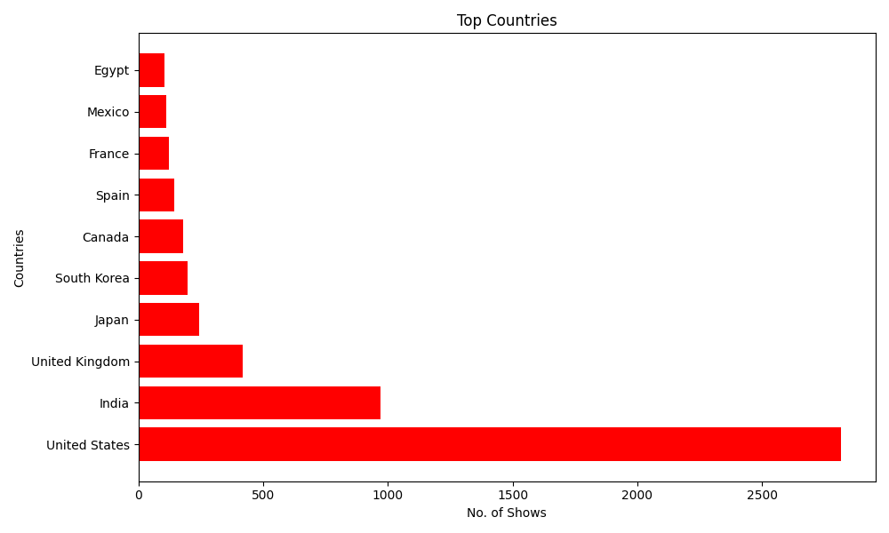
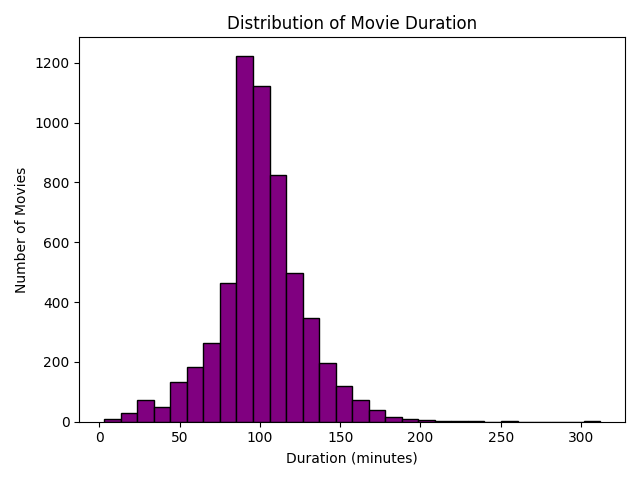
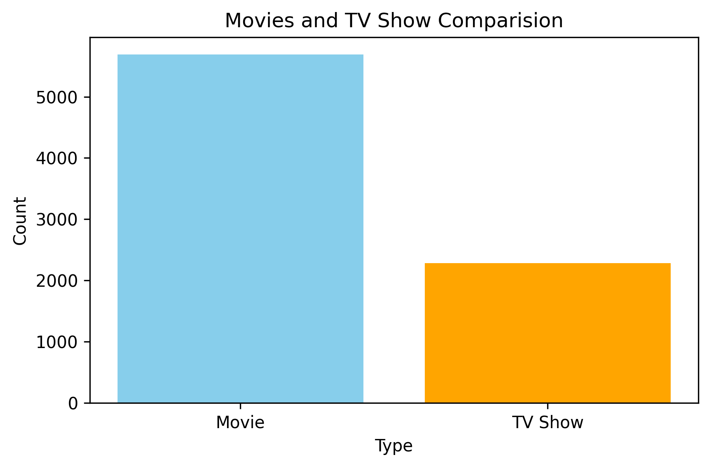

# 🎬 Netflix Data Analysis with Matplotlib

## 📌 Project Overview
This project explores the **Netflix Titles Dataset** to visualize patterns, trends, and insights using **Python** and **Matplotlib**.  
From **content ratings** to **top countries**, **movie durations**, and **release year trends**, this analysis helps in understanding how Netflix's content library is structured.

---

## 📊 Key Insights
✔ **Content Ratings** – See which ratings dominate Netflix's library.  
✔ **Top Countries** – Discover which countries produce the most Netflix content.  
✔ **Movie Durations** – Understand typical movie lengths.  
✔ **Movies vs TV Shows** – Compare the quantity of each type.  
✔ **Release Trends** – See how content production evolved over time.

---

## 🛠 Tech Stack
- **Language:** Python 🐍
- **Libraries:** Pandas, Matplotlib
- **Dataset:** `netflix_titles.csv` (Netflix public dataset)

---

## 📂 Project Files
| File Name | Description |
|-----------|-------------|
| `pro1.ipynb` | Jupyter Notebook containing the full analysis & visualizations |
| `netflix_titles.csv` | Dataset used for analysis |
| `Content_Rating_Piechart.png` | Pie chart showing content ratings distribution |
| `Countries_&_shows.png` | Bar chart of top content-producing countries |
| `movie_duration_histogram.png` | Histogram of movie durations |
| `Movies_&_TvShows_Comparision.png` | Bar chart comparing Movies vs TV Shows |
| `Release_vs_Shows.png` | Scatter plot of release years vs number of shows |
| `Releases.png` | Line plot showing trends of releases over time |

---

## 📷 Visualizations

### **1️⃣ Content Ratings Distribution**

### **2️⃣ Top Countries Producing Netflix Content**

### **3️⃣ Movie Duration Distribution**

### **4️⃣ Movies vs TV Shows**

### **5️⃣ Release Year vs Shows**

